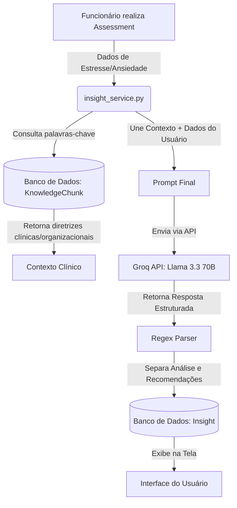

# Guia de Apresentação: Inteligência Artificial & Banco de Dados (BurnoutZero)

Este documento foi elaborado para preparar você para a banca avaliadora ou apresentação ao cliente do projeto **BurnoutZero**. Ele detalha o funcionamento interno de toda a camada de IA (LLM & RAG) e a modelagem do Banco de Dados, incluindo possíveis perguntas técnicas com suas respectivas respostas ideais.

---

## Visão Geral da Arquitetura (LLM + RAG)

O fluxo de dados da Inteligência Artificial do BurnoutZero segue o modelo **RAG (Retrieval-Augmented Generation)**:



---

## 1. Camada de Inteligência Artificial (LLM)

### Modelo Utilizado
* **LLM:** `llama-3.3-70b-versatile` (desenvolvido pela Meta).
* **API de Inferência:** **Groq API** (usando a biblioteca oficial `groq`).

### Por que Groq e Llama 3.3?
1. **Velocidade de Inferência Extrema:** O Groq utiliza chips especializados chamados **LPUs (Language Processing Units)**, que entregam respostas em tempo real por meio de *streaming* (Server-Sent Events - SSE), com latência baixíssima.
2. **Modelo de Alta Performance Open-Source:** O Llama 3.3 de 70 bilhões de parâmetros possui capabilidade clínica e de raciocínio comparável a modelos proprietários (como GPT-4), mas com custos de infraestrutura drasticamente menores.

### Personas e Prompts (Role-Based)
O sistema possui 3 prompts principais configurados no backend (`backend/ai_engine/prompts/`):
* **Employee Chat (`employee_chat_prompt.py`):** Assistente acolhedor e empático. Focado em autocuidado, respiração e bem-estar. **Regra de ouro:** Nunca realizar diagnósticos clínicos.
* **Psychologist Chat (`psychologist_prompt.py`):** Suporte técnico para terapeutas estruturarem suas anotações ou consultas.
* **Manager Prompt (`manager_prompt.py`):** Focado em análise estatística e métricas de desempenho/engajamento de equipes sem expor dados individuais.

---

## 2. O que é RAG (Retrieval-Augmented Generation)?

### Como Funciona no Projeto
Em vez de depender apenas do conhecimento geral pré-treinado do Llama, o sistema utiliza a técnica **RAG** para alimentar o modelo com diretrizes e boas práticas organizacionais/clínicas em tempo real:
1. Os dados da avaliação (ex: níveis de estresse e burnout) são convertidos em uma consulta de busca.
2. O sistema busca no banco de dados (`KnowledgeChunk`) trechos de documentos científicos ou de políticas internas corporativas relevantes.
3. Esse conteúdo é acoplado ao prompt enviado para a API da Groq.
4. **Resultado:** Respostas cientificamente embasadas e livres de "alucinações" (erros factuais da IA).

### Prontidão para Busca Vetorial (pgvector)
No código de produção (`rag_service.py`), o projeto está preparado para utilizar a extensão **`pgvector`** do PostgreSQL. Isso permite transformar os textos de diretrizes clínicas em vetores matemáticos (embeddings) e realizar buscas por **Similaridade de Cosseno**:
```python
# Trecho preparado no backend para busca semântica por proximidade vetorial:
# KnowledgeChunk.objects.order_by(KnowledgeChunk.embedding.cosine_distance(q_emb))[:k]
```
*(Nota: Para fins de desenvolvimento rápido local/SQLite, o sistema busca os chunks estruturados de maneira simplificada, mas a arquitetura já está 100% pronta para a busca vetorial).*

---

## 3. Camada de Banco de Dados (PostgreSQL 16)

O banco de dados foi modelado utilizando o ORM do Django, garantindo integridade e segurança. Os principais modelos e suas responsabilidades são:

### Usuários e Perfis (`User`)
* **Modelo Personalizado:** Herda de `AbstractUser` do Django.
* **Atributos:**
  * `role`: Define as permissões de acesso (`employee`, `psychologist`, `manager`).
  * `company_code`: Código da empresa para isolamento de dados.
  * `department`: Departamento do funcionário (ex: TI, RH).

### Saúde Mental (`Assessment` e `Insight`)
* **`Assessment`:** Guarda as notas numéricas de cada avaliação (estresse, ansiedade, burnout e depressão de 0 a 25) e calcula o nível de risco (`low`, `medium`, `high`).
* **`Insight`:** É gerado pela IA no momento em que a avaliação é feita. Armazena a `text` (análise contextualizada) e as `recommendations` (dicas de ação). Possui a relação `validated_by` para permitir que psicólogos validem ou editem as recomendações no futuro.

### Mecânica de Gamificação (`GamificationPoints` & `GamificationState`)
* **`GamificationPoints`:** Log transacional que registra cada ganho de ponto (motivos: `assessment_complete`, `streak_bonus`, `water_challenge`, etc.).
* **`GamificationState`:** Guarda o estado consolidado de engajamento do usuário (XP total, nível atual, dias de ofensiva/streak ativo e estados dos mini-desafios diários de água, respiração e humor).

### Segurança e Privacidade (`Sector`)
* **Agrupamento por Setor:** Os gerentes (`managers`) não têm acesso às avaliações individuais dos funcionários. Eles apenas enxergam as métricas consolidadas por meio do modelo `Sector`.
* **Privacidade Absoluta:** O setor só expõe médias agregadas, garantindo que o colaborador responda à avaliação com total sinceridade sem medo de represálias.

---

## 4. Perguntas e Respostas da Banca (FAQ)

### P1: Como vocês treinaram a Inteligência Artificial do projeto?
> **Resposta Ideal:** *"Nós não realizamos o treinamento do modelo do zero (pre-training) nem o ajuste fino (fine-tuning), pois isso exigiria milhões de registros clínicos privados e um custo de computação inviável. Em vez disso, aplicamos duas técnicas modernas de Engenharia de Prompts: **In-Context Learning (Aprendizado em Contexto)** com instruções de comportamento estritas (System Prompts) e **RAG (Geração Aumentada de Recuperação)**. Com o RAG, nós injetamos diretrizes científicas de saúde ocupacional salvas no nosso banco diretamente no prompt antes da inferência, garantindo respostas seguras e sem alucinações."*

### P2: Como vocês garantem que a IA não dê um diagnóstico médico errado para o funcionário?
> **Resposta Ideal:** *"Isso é controlado em duas camadas: **1) Engenharia de Prompts:** O prompt de sistema do assistente de acolhimento tem uma instrução prioritária e explícita que diz 'Nunca realize diagnósticos de doenças. Sugira técnicas práticas de autocuidado e encoraje o funcionário a buscar apoio profissional'. **2) Arquitetura de Fallback:** Se a API de inteligência artificial falhar por qualquer motivo, o backend possui um mecanismo de contingência que gera um alerta padrão baseado apenas na nota do assessment, recomendando consulta com a equipe de psicologia interna."*

### P3: Por que escolheram a API da Groq e o modelo Llama 3.3 em vez de usar OpenAI/ChatGPT?
> **Resposta Ideal:** *"Escolhemos a infraestrutura da **Groq** por dois fatores cruciais: **latência** e **privacidade/custo**. O Groq roda sobre LPUs, o que nos permite fazer o streaming de respostas de forma instantânea para o usuário (mais de 200 tokens por segundo), criando uma experiência de chat muito mais fluida. Além disso, o modelo **Llama 3.3 70B** é de código aberto, o que nos dá flexibilidade técnica e reduz drasticamente o custo por requisição em comparação a modelos proprietários como os da OpenAI."*

### P4: Como o banco de dados lida com a privacidade dos dados de saúde mental dos colaboradores frente aos gestores?
> **Resposta Ideal:** *"A arquitetura de banco de dados e as rotas da API foram desenhadas seguindo o princípio de menor privilégio. O modelo `Assessment` (avaliações individuais) e o `ChatMessage` (conversas do chat) estão estritamente vinculados ao ID do colaborador (`ForeignKey` direta). As consultas do painel do gestor (`manager_prompt` e as views de gerência) utilizam agregadores que calculam apenas médias do setor (como 'porcentagem de pessoas sob risco alto' e 'média de burnout por departamento'). Não existe nenhuma rota de API ou query que exponha os dados brutos de um funcionário para o seu gestor."*

### P5: Como funciona o sistema de recomendação personalizado (RAG) no projeto?
> **Resposta Ideal:** *"Quando o funcionário finaliza uma avaliação, o serviço de RAG converte as pontuações em palavras-chave e busca no modelo `KnowledgeChunk` os artigos e manuais médicos cadastrados que mais se alinham àquela situação. O texto desses artigos é anexado como contexto no prompt final. O modelo Llama analisa tanto a situação atual do funcionário quanto as diretrizes desse artigo clínico recuperado e, a partir disso, gera o insight final e as recomendações práticas personalizadas em formato markdown."*
